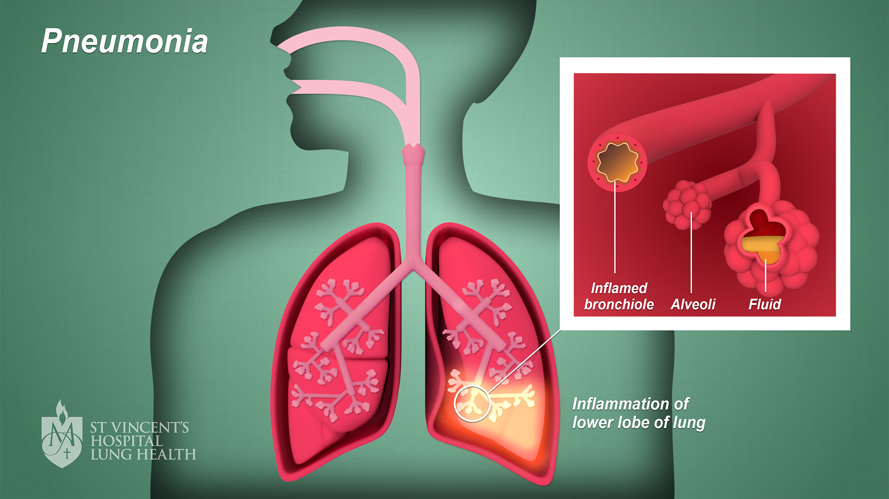
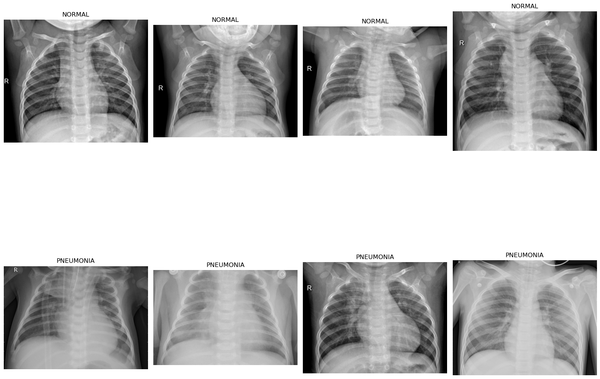
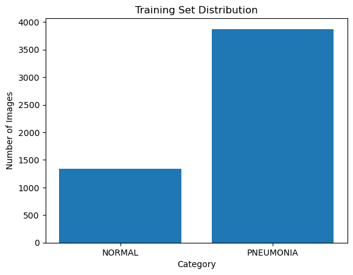
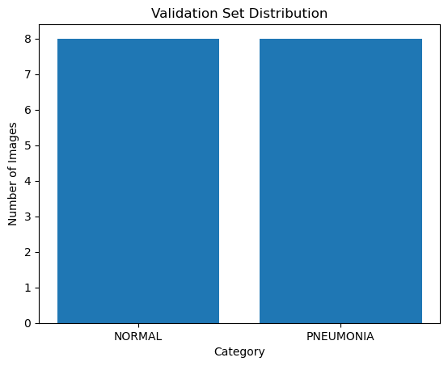
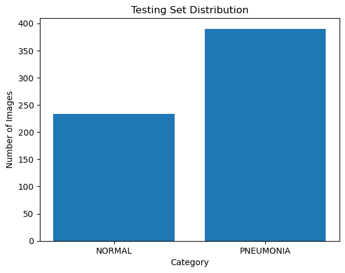

# PHASE 4 PROJECT: CHEST X-RAY IMAGE CLASSIFICATION.
IMAGE CLASSIFIER FOR PNEUMONIA DETECTION

## Project Overview:
Pneumonia is an infection that inflames the air sacs in one or both lungs. The air sacs may fill with fluid or pus (purulent material), causing cough with phlegm or pus, fever, chills, and difficulty breathing.
Patients presenting with difficulty in breathing or presenting other respiratory symptoms for pneumonia in the emergency department are usually given a chest Xray. They have the advantage of lower radiation exposure, faster feasibility and better equipment portability compared to other imaging modalities such as computed tomography (CT). This diagnostic examination can provide supplemental and timely information regarding a patient’s cardiopulmonary condition and probable changes from any infectious process. Studies have shown that with faster reporting of pneumonia in Chest radiographs, the median length of hospital stays is significantly shorter, the likelihood of receiving appropriate therapy is higher, and the probability of infectious spread is lower.

However, the interpretation of CR examinations is variable and examiner-dependent. To increase the sensitivity and specificity of imaging patterns for pneumonia in Chest xrays, deep learning (DL) algorithms must become more prevalent. Prior studies have shown that the use of artificial intelligence (AI) significantly improves the detection of pneumonia in Chest radiographs.

Given the large number of examinations, reporting using AI can highlight Chest xrays with abnormalities, helping to prioritize reporting by radiologists. Further, where Chest radiographs are initially evaluated by clinicians outside regular operations, AI can be of assistance. In this situation, a well-functioning evaluation of Chest xrays by AI can significantly support clinicians’ decision making.

The target is to use algorithms to classify medical images for assistance in diagnosis, treatment planning, and disease monitoring.Our project aims to create an image classifier for pneumonia detection using machine learning techniques. Pneumonia is a common and sometimes fatal respiratory illness, and early identification is critical for optimal treatment and patient outcomes. Our key objective is to build a strong classifier capable of correctly recognizing pneumonia in chest X-ray pictures using convolutional neural networks (CNNs) and sophisticated image processing methods.

## Business Problem:

Kenyatta National Hospital (KNH) is currently facing a significant challenge due to an ongoing strike among healthcare workers. This strike has resulted in a shortage of staff, particularly in the radiology department, where the interpretation of chest X-ray images is crucial for diagnosing cases such as pneumonia. Despite being one of the largest referral hospitals in Kenya, KNH struggles with timely and accurate diagnosis due to limited radiology resources, high patient volumes, and manual interpretation of chest X-ray images by healthcare professionals.

The limited workforce has put immense strain on the hospital's diagnostic capabilities, leading to delays in diagnosing pneumonia cases and potentially compromising patient care. With fewer staff available to interpret X-ray images, there's a risk of errors and inconsistencies in diagnosis, leading to potential diagnostic discrepancies and treatment delays, which could have serious implications for patient outcomes.

The overarching goal is to provide a solution that can alleviate the strain on the hospital's diagnostic services. By developing an automated image classifier for pneumonia detection, we aim to streamline the diagnosis process, reduce reliance on manual interpretation, and ensure timely and accurate identification of pneumonia cases from chest X-ray images.

Our mission is to empower KNH with the tools and resources needed to overcome the challenges posed by the ongoing strike and continue delivering high-quality healthcare to patients in need. Through our collaboration, we strive to make a positive impact on patient care and outcomes at Kenyatta National Hospital.

## Data Understanding:
The images we used for our project were sourced from https://www.kaggle.com/datasets/paultimothymooney/chest-xray-pneumonia
The dataset is organized into 3 folders (train, test, val) and contains subfolders for each image category (Pneumonia/Normal). There are 5,856 X-Ray images (JPEG) and 2 categories (Pneumonia/Normal).

Chest X-ray images (anterior-posterior) were selected from retrospective cohorts of pediatric patients of one to five years old from Guangzhou Women and Children’s Medical Center, Guangzhou. All chest X-ray imaging was performed as part of patients’ routine clinical care.

The nearly 6000 images are classified into two categories: Normal or Pneumonia.
As provided by Kaggle, the images are divided into three subsets:

train - 5,216 images:

validate - 16 images:

test - 624 images:

## Modeling and Results:

## Evaluation:
## Conclusions and Recommendations:
