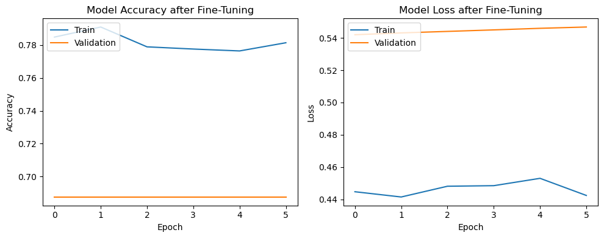
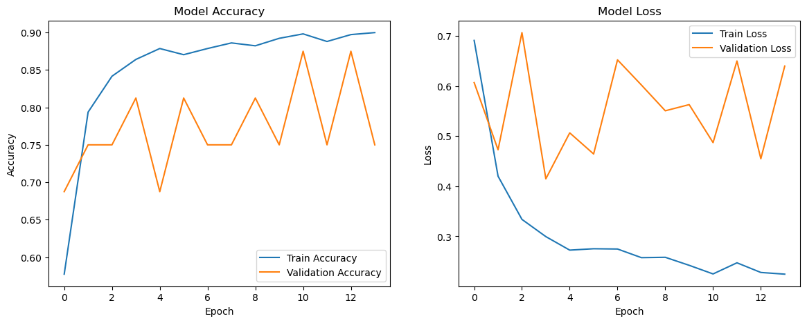

# PHASE 4 PROJECT: CHEST X-RAY IMAGE CLASSIFICATION.
IMAGE CLASSIFIER FOR PNEUMONIA DETECTION

## Table of Contents:
1. Overview
2. Business Understanding
3. Problem Statement
4. Data Understanding
5. Modeling and Results
6. Conclusion
7. Recommendation

## Overview:
Generally, our project aims to leverage machine learning and deep learning techniques to develop an accurate and efficient tool for pneumonia detection from chest X-ray images. By automating this process, the classifier can assist healthcare professionals in making timely and informed decisions, ultimately improving patient outcomes and healthcare efficiency.

## Business Understanding:
Pneumonia is an infection that inflames the air sacs in one or both lungs. The air sacs may fill with fluid or pus (purulent material), causing cough with phlegm or pus, fever, chills, and difficulty breathing.
Patients presenting with difficulty in breathing or presenting other respiratory symptoms for pneumonia in the emergency department are usually given a chest Xray. They have the advantage of lower radiation exposure, faster feasibility and better equipment portability compared to other imaging modalities such as computed tomography (CT). This diagnostic examination can provide supplemental and timely information regarding a patient’s cardiopulmonary condition and probable changes from any infectious process. Studies have shown that with faster reporting of pneumonia in Chest radiographs, the median length of hospital stays is significantly shorter, the likelihood of receiving appropriate therapy is higher, and the probability of infectious spread is lower.

However, the interpretation of CR examinations is variable and examiner-dependent. To increase the sensitivity and specificity of imaging patterns for pneumonia in Chest xrays, deep learning (DL) algorithms must become more prevalent. Prior studies have shown that the use of artificial intelligence (AI) significantly improves the detection of pneumonia in Chest radiographs.

Given the large number of examinations, reporting using AI can highlight Chest xrays with abnormalities, helping to prioritize reporting by radiologists. Further, where Chest radiographs are initially evaluated by clinicians outside regular operations, AI can be of assistance. In this situation, a well-functioning evaluation of Chest xrays by AI can significantly support clinicians’ decision making.

The target is to use algorithms to classify medical images for assistance in diagnosis, treatment planning, and disease monitoring.Our project aims to create an image classifier for pneumonia detection using machine learning techniques. Pneumonia is a common and sometimes fatal respiratory illness, and early identification is critical for optimal treatment and patient outcomes. Our key objective is to build a strong classifier capable of correctly recognizing pneumonia in chest X-ray pictures using convolutional neural networks (CNNs) and sophisticated image processing methods.

## Problem Statement:

Kenyatta National Hospital (KNH) is currently facing a significant challenge due to an ongoing strike among healthcare workers. This strike has resulted in a shortage of staff, particularly in the radiology department, where the interpretation of chest X-ray images is crucial for diagnosing cases such as pneumonia. Despite being one of the largest referral hospitals in Kenya, KNH struggles with timely and accurate diagnosis due to limited radiology resources, high patient volumes, and manual interpretation of chest X-ray images by healthcare professionals.

The limited workforce has put immense strain on the hospital's diagnostic capabilities, leading to delays in diagnosing pneumonia cases and potentially compromising patient care. With fewer staff available to interpret X-ray images, there's a risk of errors and inconsistencies in diagnosis, leading to potential diagnostic discrepancies and treatment delays, which could have serious implications for patient outcomes.

The overarching goal is to provide a solution that can alleviate the strain on the hospital's diagnostic services. By developing an automated image classifier for pneumonia detection, we aim to streamline the diagnosis process, reduce reliance on manual interpretation, and ensure timely and accurate identification of pneumonia cases from chest X-ray images.

Our mission is to empower KNH with the tools and resources needed to overcome the challenges posed by the ongoing strike and continue delivering high-quality healthcare to patients in need. Through our collaboration, we strive to make a positive impact on patient care and outcomes at Kenyatta National Hospital.

## Data Understanding:
The images we used for our project were sourced from https://www.kaggle.com/datasets/paultimothymooney/chest-xray-pneumonia
The dataset is organized into 3 folders (train, test, val) and contains subfolders for each image category (Pneumonia/Normal). There are 5,856 X-Ray images (JPEG) and 2 categories (Pneumonia/Normal).

Chest X-ray images (anterior-posterior) were selected from retrospective cohorts of pediatric patients of one to five years old from Guangzhou Women and Children’s Medical Center, Guangzhou. All chest X-ray imaging was performed as part of patients’ routine clinical care.

The nearly 6000 images are classified into two categories: Normal or Pneumonia.
As provided by Kaggle, the images are divided into three subsets:

train - 5,216 images:

validate - 16 images:

test - 624 images:

## Modeling and Results:

- ResNet 50:

Training Performance:

During training over 163 batches in 286 seconds (about 2 seconds per step), the model recorded an accuracy of 78.32% and a loss of 0.4388, with a summarized Training Accuracy of 78.26%. This level of accuracy is indicative of the model’s learning capability, although it is somewhat lower than the accuracies observed in previous iterations, suggesting potential room for optimization.

- CNN: 

Training Performance:

Over 163 batches processed in 116 seconds (around 714ms per step), the model attained an Accuracy of 92.14% and a Loss of 0.1883, summarized as Training Accuracy of 92.16%. This high level of accuracy indicates excellent learning from the training dataset, with the model effectively minimizing error.

## Conclusions:
The exploration featured two primary models: a Transfer Learning model leveraging the ResNet50 architecture for feature extraction coupled with custom layers for the classification task, and a Custom CNN Model constructed from scratch, which incorporated a variety of data augmentation strategies. Among these, after a thorough comparison based on final test accuracies, the Custom CNN Model emerged as the superior model, showcasing the highest test accuracy and signifying a robust performance on the test dataset. This was achieved without specific fine-tuning processes but through the effective use of extensive data augmentation.

 Given more time we may, through more tweaking of the hyper parameters, be able to find a more successful model. Our final step is to get the model and the portable X-Ray machines into the hands of people who need them.

## Recommendations: 
-  *Further Hyperparameter Tuning:* Allocate additional time and resources to fine-tune the hyperparameters of the Custom CNN Model. This may involve exploring different configurations to optimize performance further.
- *Evaluation of Alternative Architectures:* While the Custom CNN Model showed promising results, consider exploring alternative architectures beyond ResNet50 and the Custom CNN Model. This could involve experimenting with different pre-trained models or novel architectures to potentially improve performance.
- *Integration with Portable X-Ray Machines:* Efforts should be made to seamlessly integrate the trained Custom CNN Model with portable X-ray machines. This integration will enable healthcare professionals to quickly analyze X-ray images on-site, facilitating timely diagnosis and treatment decisions, especially in remote or resource-constrained areas.

## Limitations
The performance of CNN models is greatly improved with the use of more data (images) in the training process. Although the available data used for this project is limited, an attempt to generate more training data by creating augmented images from the given image collection may provide sufficient to achieve improved results.
In an effort to reduce training times, only a limited number of models were attempted. Running additional models with greater levels of complexity & a greater number of hyperparameters adjusted, may have eventually yielded a more precise model.

## Outline Approach
Data Acquisition and Preprocessing - This involves use of representative data that contains both healthy and pneumonia-infected cases. We annotate the images with labels indicating the presence or absence of pneumonia. We also enhance image quality and consistency by resizing, normalization/standardizations of values to a common range, facilitating better training for the deep learning model and reduction of noise to improve the model's ability to identify the true underlying structures in the X-ray.
Model Development - This involves selection of a suitable deep learning architecture such as Convolutional Neural Network(CNN) that has had good traction in medical image analysis. We then train the model on the preprocessed dataset, splitting it into training, vaidation, and tests sets. We also address class imbalance, if any, by data augmentation to artificially expand the training data then monitor the training process by adjusting parameters for optimal performance.
Model Evaluation - In the model evaluation phase, we assess the performance of the trained models using key metrics such as accuracy and confusion matrices. Through the interpretation of these metrics, we gain insights into the models' efficacy in distinguishing between normal and pneumonia cases in X-ray images. Additionally, visualization techniques are employed to dissect the models' predictions, providing valuable insights into their strengths and weaknesses. This comprehensive analysis allows for informed decisions regarding model refinement and optimization, ultimately ensuring the development of robust classifiers for accurate binary image classification.
Interpretation and Deployment - We explore techniques for explaining the model's decision-making process for instance, saliency maps, class activation maps to gain insights into how it differentiates between healthy and pneumonia-infected X-rays. If the model achieves satisfactory performance, consider deploying it in a controlled clinical environment for further validation and potential real-world use cases.

